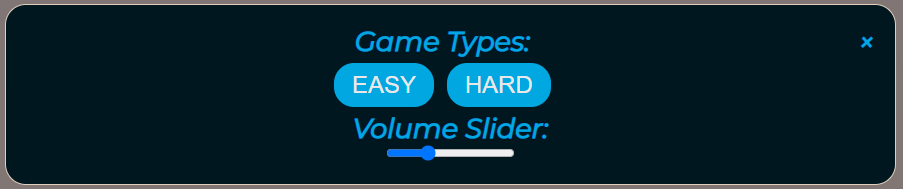
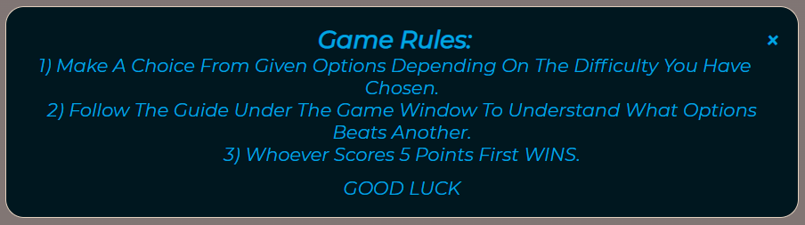
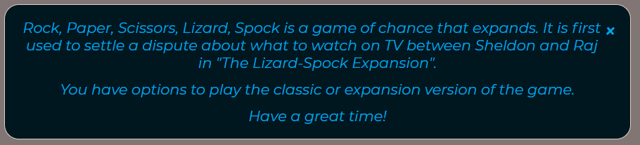
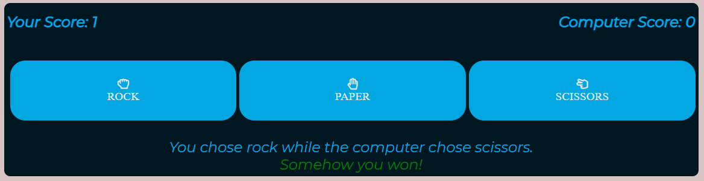
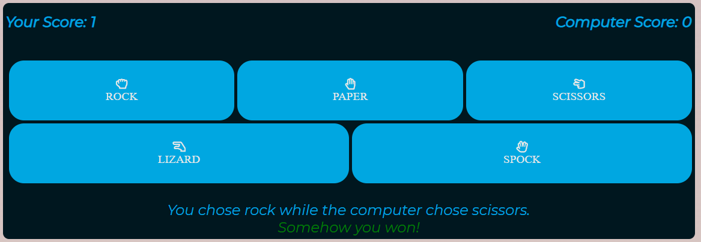
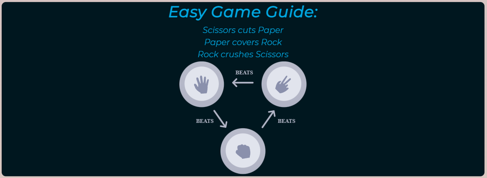
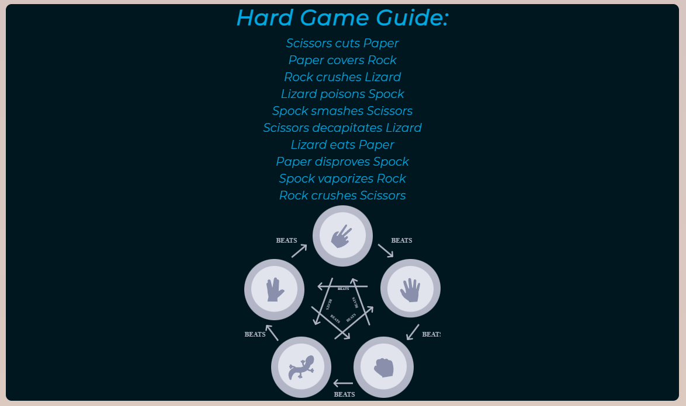
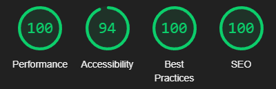
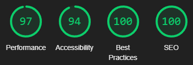

# Rock Paper Scissors Lizard Spock - Game

**[Live site](https://erykslezak.github.io/CIPP2/)**

---

## Index

- <a href="#context">Context</a>
- <a href="#ux">UX</a>
  - <a href="#ux-stories">User stories</a>
  - <a href="#ux-wireframes">Wireframes</a>
  - <a href="#ux-theme">Theme</a>
- <a href="#features">Features</a>
  - <a href="#features-all">Site wide</a>
  - <a href="#features-future">Still to implement</a>
- <a href="#technologies">Technologies Used</a>
- <a href="#testing">Testing</a>
  - <a href="#testing-auto">Automated</a>
  - <a href="#testing-manual">Manual</a>
  - <a href="#testing-responsive">Responsiveness</a>
  - <a href="#testing-unresolved">Unresolved issues</a>
  - <a href="#testing-bugs">Known bugs</a>
- <a href="#deployment">Deployment</a>
- <a href="#credits">Credits</a>

---

## Context

Rock Paper Scissors Lizard Spock is a game based on the Big Bang Theory (TV Show). The game lets users play either an original game or the more complicated one.

<a style="text-align:right" href="#top">Go to index :arrow_double_up:</a>

## UX

### Overview

The site is presented in a minimalist but effective way, providing all the information the user would ever need. Users can find out more about the game, instructions on how to play, game settings by using different modal buttons depending on the users needs.

### User stories

For ease of reference, the means by which a user's expectations have been met are summarised in the tables below:

| As a **User** I want | How this is achieved                                                                                                                                                           
:-|:-
To be able to play classic as well as expansion game which is the 'lizard and spock'. | The game button when pressed pops out a modal which gives the user both 'easy' and 'hard' game options. Which is either classic or expansion.
To be able to see my score. | The score is shown in the game container. It is also showing the computers score and increments every round.
A clean, consistent interface which will not confuse users. | The navbar has 4 buttons and title. All buttons except restart button have modals that pop up on button click. Clean look has been achieved with radius given to each container. An animated stylesheet has also been imported to give the user more experience.
To be able to play the game on any device.                                                                                                   | The game has been designed for any type of device. This was done by using flex boxes and media queries. This is addressed in the <a href="#testing-responsive">Responsiveness</a> section below.

### Wireframes

The wireframes were successfully converted into a live functioning website across all devices.

The full suite of wireframes for **desktop**, **tablet** and **mobile** devices, plus a **sitemap**, can be accessed [here](wireframes/).

### Site theme

A clean, clear and simple aesthetic has been implemented.

The [Coolors](https://coolors.co/) website has been use to generate the palette. There were 4 colors used mainly across the website and they are as follows:

- Black Shadows #D3C1C3
- Almond #E2D0BE
- Cerulean Crayola #00A7E1
- Rich Black #00171F

Only one font has been used, that is [Montserrat](https://fonts.google.com/specimen/Montserrat). It has been used across all site and it suits the color pallete well.

<a style="text-align:right" href="#top">Go to index :arrow_double_up:</a>

## Features

### Sitewide

**1. Navbar**

- Navbar has 4 buttons which lets user change the game and adjust volume, restart the game, instructions on how to play and what is the game about.
- All buttons except restart have modals to give user better experience.
- It also has hover over color change.

**2. Game Settings**

- It features two game options. 'Easy' for playing the classic rock paper scissors and 'Hard' for playing the expansion version which adds Lizard and Spock.
- It gives user the ability to change the volume of sounds that are being played when one of game buttons have been pressed.
- User is able to close the modal by either pressing the 'x' button or outside of the box.

**3. Restart Button**

- Button to restarts the game current on going game or when the game is over.
- Designed for only work when at least on game has been chosen.

**4. How to play**

- Modal button that gives user instructions on how to play and win the game.
- User is able to close the modal by either pressing the 'x' button or outside of the box.

**5. About**

- Brief description of where the expansion version of the game came from.
- User is able to close the modal by either pressing the 'x' button or outside of the box.

**6. Select Difficulty**

- A notice for user to select the game difficulty.
- This message hides itself after any difficulty has been chosen.

**7. Easy/Hard Game**

- Both game difficulties contain the same scoring and result messages.
- Scores have been divided into separate for user and computer.
- There are two versions of results depending if it is win/lose or draw.
- Easy game has 3 buttons, Rock, Paper and Scissors while the hard game has another two being Lizard and Spock.

**8. Easy/Hard Game Guide**

- A container that reminds user of what each option defeats another by text and an image.

### Features left to implement

- Two player function on one device.

  _The ability to play the game with your friend._

- Online multiplayer with lobbies.

  _The ability to see rooms with players wiating for a match._

<a style="text-align:right" href="#top">Go to index :arrow_double_up:</a>

## Technologies Used

### Languages

- HTML
- CSS
- JavaScript

### Project management

- [GitHub](https://github.com/) - Version control and deployment
- [GitPod](https://gitpod.io/) - IDE used to code the site
- [Balsamiq](https://balsamiq.com/wireframes/) - Wireframe creation app

### Style and theme

- [Font Awesome](https://fontawesome.com/) - Icon used for menu in footer
- [Google Fonts](https://fonts.google.com/) - PT Sans and Antic Slab fonts
- [Coolors](https://coolors.co/) - Generate color pallette.

### Online resources

- [Stack Overflow](https://stackoverflow.com/)
- [W3 Schools](https://www.w3schools.com/)
- [Am I Responsive?](http://ami.responsivedesign.is/) - Generate responsive image.
- [Google Images](https://www.google.com/imghp?hl=en) - All images resources.

<a style="text-align:right" href="#top">Go to index :arrow_double_up:</a>

## Testing

### Automated testing

- [Chrome DevTools](https://developers.google.com/web/tools/chrome-devtools) - Ran an audit using lighthouse on all possible options for both desktop and mobile.

Summary and Scores:

- All reports have accessibility scores lowered due to `Background and foreground colors do not have a sufficient contrast ratio.`. This goes towards the nav buttons.
- Getting `Eliminate render-blocking resources.` which slows down the page tiny bit.

 

### Main Page Desktop:

### Main Page Mobile:

Audit Scores

 

- [W3C - HTML](https://validator.w3.org/) - No errors or warnings detected - **PASS**

- [W3C - CSS](https://jigsaw.w3.org/css-validator/) - No errors or warnings detected - **PASS**

- [JShint - JavaScript](https://jshint.com/) - 26 warnings regarding `let`, `const` or `moz` and that functions can be confusing

- [CSS Lint](http://csslint.net/) - CSS lint found 6 errors and 25 warnings. - **PASS**
  - The errors are only in the root section with colors. Parsing error expecting RBRACE at every line. It is an issue with CSS Lint.

### Manual testing

The following cases were carried out across all site, both desktop and mobile to ensure that the site is functioning as expected:
**ALL PASSED**

**1. Nav bar**

- Check that each button except restart opens the correct modals.
- Check if hover color change works as expected.

**2. Game Settings**

- Check if easy or hard button will run the correct game.
- Check if easy or hard button will automatically close the modal after pressing the buttons.
- Check if the volume slider will adjust the volume the sounds that each button outputs as well as the win/lose sound.

**3. Restart Button**

- Check that the button does not work untill at least one difficulty has been chosen.
- Check if the last played game restarts.
- Check if the scores gets reset to 0.

**4. Modals**

- Check that the modals can be closed with the 'x' button as well as outside the box.
- Check if everything aligns correctly across different devices.

**5. Scores**

- Check that the score increments when player/computer wins the round.
- Check that the scores does not increment when its draw.
- Check if score resets to 0 when either the game ends or the restart button has been pressed.
- Check that the game buttons disappear when game has been finished.

**6. Game Buttons**

- Check if when button has been pressed, the right option has been chosen.

**7. Results Message**

- Check that each message outputs the right color depending on the round result.

**8. Guides**

- Check if the right guides are being shown underneath the game container depending on difficulty.
- Check if everything fits the container across all screen sizes.

### Responsiveness

The site has been designed with a mobile and tablet browsing in mind. It has been tested through all stages of development using [Chrome DevTools](https://developers.google.com/web/tools/chrome-devtools).
Media queries have been created to make sure all information and images will be responsive.

Following issues emerged but has been addressed and solved

- Scores font was too big for smaller screen devices.
  - This has been solved by reducing the font size for anything under 974pxs.
- The guides images were too big.
  - This has been solved by reducing the image width to 90% of original size.
- The modals container was getting too small.
  - For anything under 650pxs the modal container gets slightly bigger.

#### Browsers

Tested on the following:

- Chrome
- Microsoft Edge
- Safari

#### Screen sizes

Tested with Chrome DevTools using profiles for:

- BlackBerry Z30
- Galaxy Note 3
- Galaxy Note II
- Galaxy S3
- Moto G4
- Nexus 7
- iPad Mini
- iPhone 4
- Galaxy S5
- Pixel 2
- Pixel 2 XL
- iPhone 5 SE
- iPhone 6/7/8
- iPhone 6/7/8 Plus
- iPhone X
- iPad
- iPad Pro
- Surface Pro
- Nest Hub
- Nest Hub Max
- Mobile S
- Mobile M
- Mobile L
- Tablet
- Laptop
- Laptop L

Real world testing on:

- iPhone 13
- iPhone XR
- Windows

#### Unresolved Issues

- None.

### Known bugs

- None at present,

<a style="text-align:right" href="#top">Go to index :arrow_double_up:</a>

## Deployment

There is just one branch of this project and the deployed version of this site is the most current version in the repository.

### How to deploy

### GitHub Pages
To deploy this page to GitHub Pages from its [GitHub repository](https://github.com/erykslezak/CIPP1) the following steps were taken:

- Log into GitHub and locate the repository.
- At the top find and press the **settings** option
- On the left side you will see multiple options. Find the option called **Pages** and click on it.
- Under **Source** select the branch **main**, make sure that **root** has also been selected and then press **Save**.
- The site is now published. It may take a while for it to be available though.
- The site URL is just above the **Source** section visible over green background.

### Forking the GitHub Repository
To make a clone, or Fork this repository follow the steps below.

- Log into your GitHub account and find the relevant repository you want to fork.
- Click on **Fork** on the top right of the page.
- You will find the exact live copy of the repository in your own Github account.

### Making a Local Clone
To clone the repository on your device follow the steps below.

- Log into your GitHub account and find the relevant repository you would like to clone.
- Click the **Code** button next to **Add file** above the main branch.
- To clone the repository using HTTPS, under **clone with HTTPS**, copy the link.
- Open the terminal in your IDE.
- Access the directory where you want the clone to be.
- In your IDE's terminal type `git clone https://github.com/erykslezak/CIPP2.git` and press **Enter**.
- You now have a local clone.

<a style="text-align:right" href="#top">Go to index :arrow_double_up:</a>
