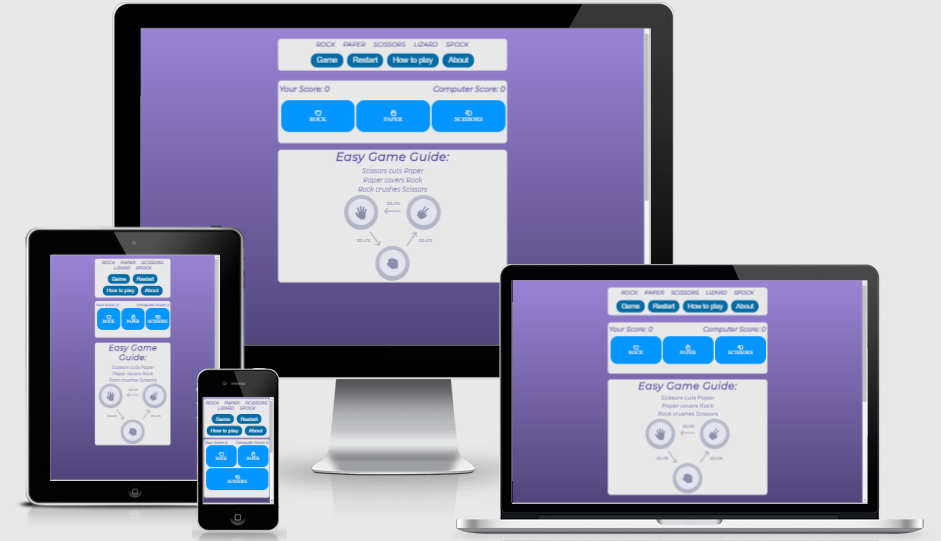

# Rock Paper Scissors Lizard Spock - Game

**[Live site](https://erykslezak.github.io/CIPP2/)**

---

## Index

- <a href="#context">Context</a>
- <a href="#ux">UX</a>
  - <a href="#ux-stories">User stories</a>
  - <a href="#ux-wireframes">Wireframes</a>
  - <a href="#ux-theme">Theme</a>
- <a href="#features">Features</a>
  - <a href="#features-all">Site wide</a>
  - <a href="#features-pages">Pages</a>
  - <a href="#features-forms">Forms</a>
  - <a href="#features-future">Still to implement</a>
- <a href="#technologies">Technologies Used</a>
- <a href="#testing">Testing</a>
  - <a href="#testing-auto">Automated</a>
  - <a href="#testing-manual">Manual</a>
  - <a href="#testing-responsive">Responsiveness</a>
  - <a href="#testing-unresolved">Unresolved issues</a>
  - <a href="#testing-bugs">Known bugs</a>
- <a href="#deployment">Deployment</a>
- <a href="#credits">Credits</a>

---